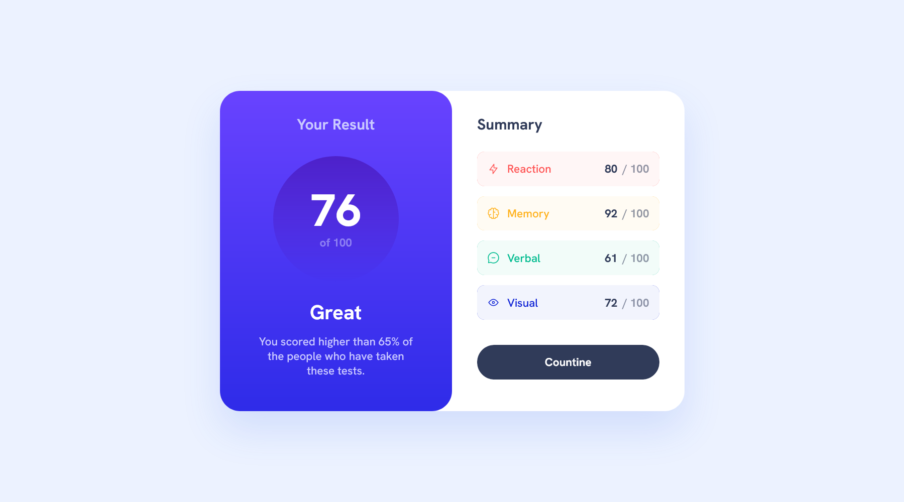

# Frontend Mentor - Results summary component solution

This is a solution to the [Results summary component challenge on Frontend Mentor](https://www.frontendmentor.io/challenges/results-summary-component-CE_K6s0maV). Frontend Mentor challenges help you improve your coding skills by building realistic projects.

## Table of contents

- [Overview](#overview)
  - [The challenge](#the-challenge)
  - [Screenshot](#screenshot)
  - [Links](#links)
- [My process](#my-process)
  - [Built with](#built-with)
  - [What I learned](#what-i-learned)
- [Author](#author)

## Overview

### The challenge

Users should be able to:

- View the optimal layout for the interface depending on their device's screen size
- See hover and focus states for all interactive elements on the page

### Screenshot




### Links

- Solution URL: [Add solution URL here](https://your-solution-url.com)
- Live Site URL: [Live](https://results-summary-component-roan.vercel.app/)

## My process

### Built with

- Semantic HTML5 markup
- Flexbox
- CSS Grid
- Desktop-first workflow
- [React](https://reactjs.org/) - JS library
- [CSS Modules](https://github.com/css-modules/css-modules) - CSS Modules are a styling library that scopes CSS to the component.
- [classnames](https://www.npmjs.com/package/classnames/) - A simple JavaScript utility for conditionally joining classNames together.

### What I learned

1. I learned to use classnames for css modules, it make it easy to combine local classes in addition to global styles like grid/flex

```React
  <main
      className={classnames(classes.resultsSummary, 'grid', 'grid--2-cols')}
    >
      {props.children}
    </main>
```

2. I also used React for the json file, i rendered the catgories using map:

```React
 const categories = categoriesData.map((categoryData) => (
    <CategoryScore
      categoryData={categoryData}
      key={categoryData.category.toString()}
    />
  ));
```

## Author

- Frontend Mentor - [@comebackist](https://www.frontendmentor.io/profile/comebackist)
- Linkedin - [@Omer Ben Yosef](https://www.linkedin.com/in/oby-se/)
